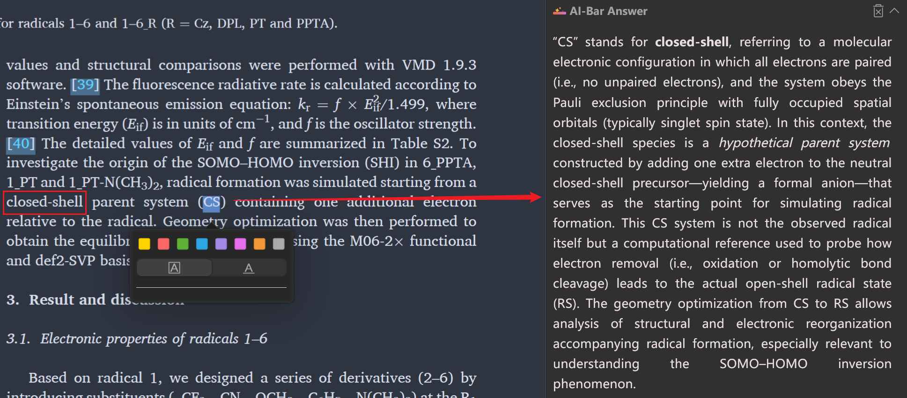
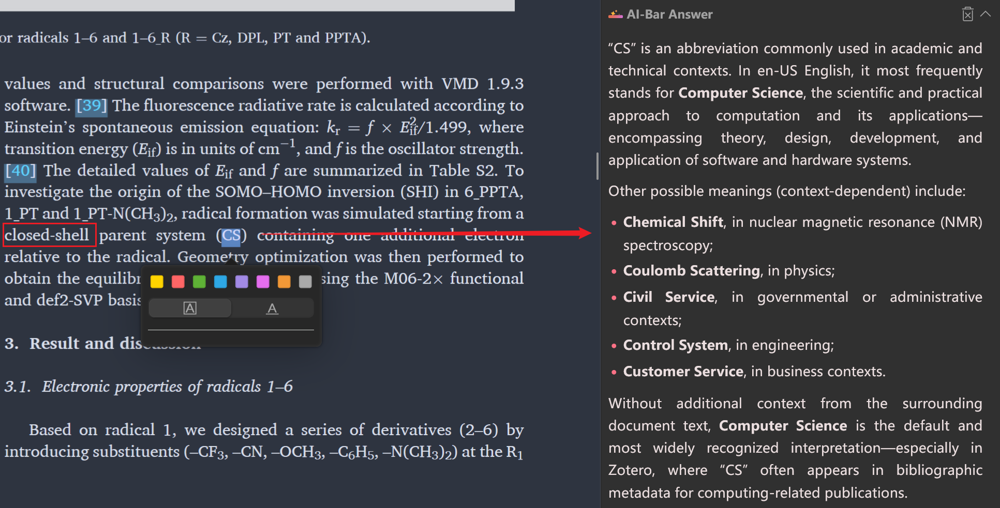

# Zotero AI Bar

  

**English** | [简体中文](docs/README_zh-CN.md)

A beautiful and handful AI assistant plugin for Zotero, putting an AI assistant right at your fingertips.

You can visit the [**Project Homepage**]() for more information and detailed tutorials.

## Support

If you find this project helpful, please consider supporting its development and maintenance:

## Features

**Leave the complex work to us, keep the simple operations for yourself.**

### Selection Toolbar

Swipe, click, and let the AI assistant handle it for you:

### Context Extraction

Automatically extract key information from literature for more accurate answers.

Enable extraction:

Disable extraction:

### Beautiful Rich Text

Headings, **bold**, _italics_, ~~strikethrough~~, `code blocks`, [links](https://github.com/swcxito/zotero-ai-bar/), blockquotes, lists...

Basic `Markdown` rendering that looks great:

Of course, math formulas are also supported:

### Modern Interface Design

Smooth and fluid animations, with more on the way!

Switch between Dark Mode and Light Mode at will:

## Usage

Here is a quick tutorial. For detailed instructions, please visit the project homepage:

1. Install the plugin.
2. Open the model settings.
3. Add a provider, enter your API Key and model.
4. Close the settings page; configurations are saved automatically.
5. Start using it!

## Roadmap

- [x] ~~Basic Features~~
- [x] ~~Beautiful Rich Text~~
- [x] ~~Modern Interface Design~~
- [x] ~~Multi-language Support (English/Chinese)~~
- [x] ~~Basic Settings~~
- [x] ~~Documentation~~
- [ ] Beautify Toolbar
- [ ] Custom Prompts
- [ ] Add Notes
- [ ] Regenerate Response
- [ ] Standalone Window Option
- [ ] Continuous Conversation
- [ ] Attachment Support
- [ ] New Chat Session
- More features are on the way...

## Contribution

Contributions of any kind are welcome! Whether it's code, documentation, testing, suggestions, or feedback. See [CONTRIBUTING](CONTRIBUTING.md) ([中文](docs/CONTRIBUTING_zh-CN.md)) for details.

## Acknowledgements

This project is built based on:
 

Inspired by parts of the implementation from:
 

## License

This project is licensed under the AGPL3.0 License. See the [LICENSE](LICENSE) file for details.
