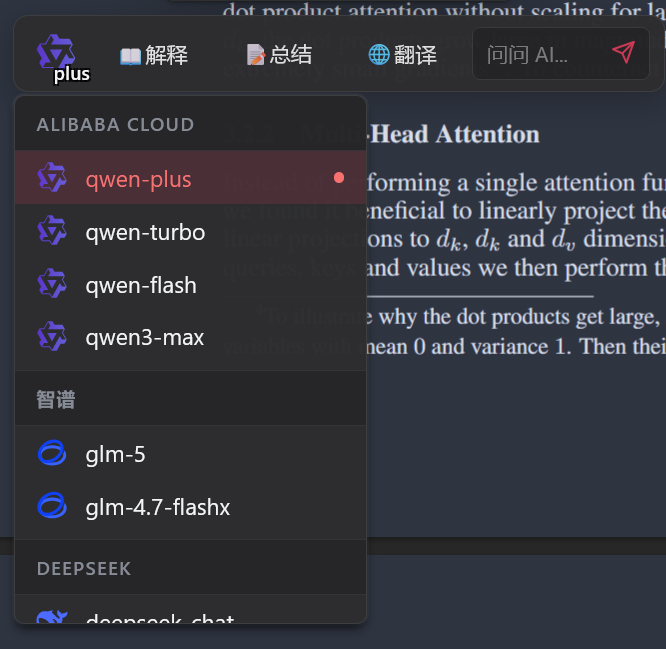

# Zotero AI Bar

  

**English** | [简体中文](docs/README_zh-CN.md)

A beautiful and handful AI assistant plugin for Zotero, putting an AI assistant right at your fingertips.

You can visit the [**Project Homepage**](https://zotero.fukeke.com) for more information and detailed tutorials.

## Support

If you find this project helpful, please consider supporting its development and maintenance:

## What's New in v1.0beta

Changes below are summarized from commits after `v0.3.4`.

### Config v2 — New Provider & Model Architecture

- **Data-driven providers**: Replaced hardcoded provider list with `common_providers.min.json` — supports **27 providers** and **763 models** out of the box.
- **Native SDK dispatch**: Each provider now uses its own AI SDK (`@ai-sdk/anthropic`, `@ai-sdk/google`, `@ai-sdk/openai`, etc.) instead of routing everything through OpenAI-compatible. Providers with custom endpoints (DeepSeek, Zhipu, MiniMax, etc.) continue to use `@ai-sdk/openai-compatible` with proper namespacing for streaming.
- **Lazy-loading**: Provider metadata is loaded on-demand to reduce startup overhead.
- **Multi-env support**: Providers with multiple environment variables (e.g., Azure) show separate input fields in the configuration dialog.

### Redesigned Model Management Dialog

- **Provider browser**: Centered modal with search, alphabetical sorting, and pinned common providers (OpenAI, Google, Anthropic, etc.) at the top.
- **Model selection popup**: Browse and search provider-specific models with family-based icons. Type a model name and press Enter to add directly.
- **Family-aware model metadata**: Model family is resolved from `common_providers.json` (default: `unknown` instead of the previous `gpt` fallback).
- **Dedup protection**: Prevents adding duplicate models within the same provider.

### Other Improvements

- **Custom prompt management**: Dedicated prompt editor page with drag-to-reorder support.
- **Smart copy** and improved response interaction.
- **Standalone chat window** with host mode integration.
- **Formula block optimization** for better math rendering.
- **Refactored chat flow**: `ChatManager` for cleaner request handling.
- **UI improvements**: Streamlined model selector on toolbar, retry button for failed requests, stream update speed settings with localization.
- Removed deprecated `providerInfo.ts` and legacy `UserProvider`/`UserProviderModel` types.

## What's New in v0.3

- model selector on the toolbar, no need to open settings page to switch models.
  

- Retry button for failed requests, no need to re-enter the prompt.
  

- Added and refined provider/model support, including compatibility updates for Qwen and MiniMax.
- Improved Zotero 7 compatibility and registration parameter handling.
- Added stream update speed settings with localization support.
- Enhanced prompt behavior and selected-text analysis quality.
- Improved formula rendering and multiple UI/component details for better stability and consistency.

## Features

**Leave the complex work to us, keep the simple operations for yourself.**

### Selection Toolbar

Swipe, click, and let the AI assistant handle it for you:

### Context Extraction

Automatically extract key information from literature for more accurate answers.

Enable extraction:

Disable extraction:

### Beautiful Rich Text

Headings, **bold**, _italics_, ~~strikethrough~~, `code blocks`, [links](https://github.com/swcxito/zotero-ai-bar/), blockquotes, lists...

Basic `Markdown` rendering that looks great:

Of course, math formulas are also supported:

### Modern Interface Design

Smooth and fluid animations, with more on the way!

Switch between Dark Mode and Light Mode at will:

## Usage

Here is a quick tutorial. For detailed instructions, please click and visit the project [homepage](https://zotero.fukeke.com)

1. Install the plugin.
2. Open the model settings.
3. Add a provider, enter your API Key and model.
4. Close the settings page; configurations are saved automatically.
5. Start using it!

Note: Requests are currently mutually exclusive. Starting a new request will cancel the previous streaming request.

## Roadmap

- [x] ~~Basic Features~~
- [x] ~~Beautiful Rich Text~~
- [x] ~~Modern Interface Design~~
- [x] ~~Multi-language Support (English/Chinese)~~
- [x] ~~Basic Settings~~
- [x] ~~Documentation~~
- [ ] Beautify Toolbar
- [x] ~~Custom Prompts~~
- [ ] Add Notes
- [ ] Regenerate Response
- [x] ~~Standalone Window Option~~
- [ ] Continuous Conversation
- [ ] Attachment Support
- [ ] New Chat Session
- More features are on the way...

## Contribution

Contributions of any kind are welcome! Whether it's code, documentation, testing, suggestions, or feedback. See [CONTRIBUTING](CONTRIBUTING.md) ([中文](docs/CONTRIBUTING_zh-CN.md)) for details.

## Acknowledgements

This project is built based on:
 

Inspired by parts of the implementation from:
 

## License

This project is licensed under the AGPL3.0 License. See the [LICENSE](LICENSE) file for details.
