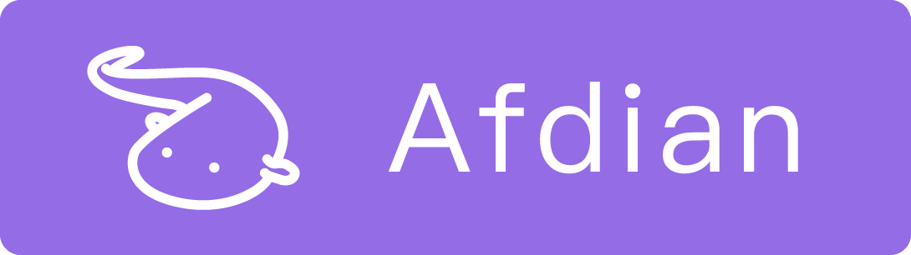
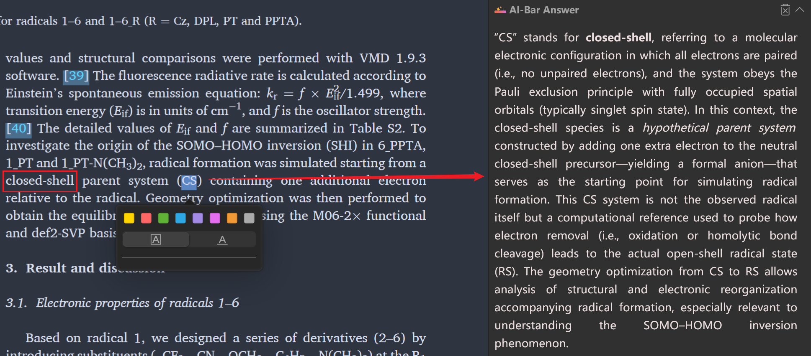
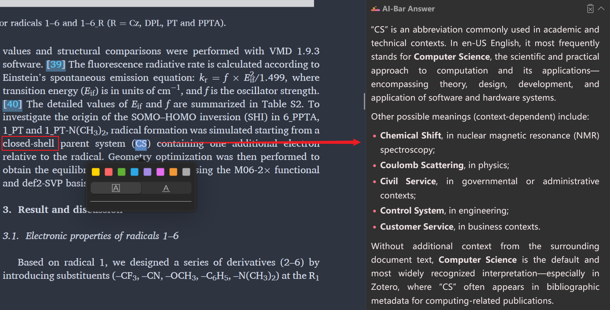

# Zotero AI Bar

**English** | [简体中文](docs/README_zh-CN.md)

A beautiful and handy AI toolbar plugin for Zotero, putting an AI assistant right at your fingertips.

You can visit the [**Project Homepage**](https://zotero.fukeke.com) for more information and detailed tutorials.

## Support

If you like this project, please give it a ⭐ on GitHub — it really helps!

If you find this project helpful, please consider supporting its development and maintenance:

## What's New in v1.3

### Agent / Tool Calling

- **Autonomous agent mode**: The AI can now call tools to search the document, read pages/lines, search your library, capture PDF pages as images, ask you clarifying questions, and more — no need to manually feed context.
- **Tool call cards**: Each tool invocation renders as a collapsible card showing inputs and outputs inline, interleaved with the reply text in stream order.

### Thinking Effort Control

- A new **thinking effort** selector on the input bar lets you pick reasoning depth (`none / low / medium / high / xhigh`) per session.
- A **default thinking effort** setting is available in the preferences (defaults to `none`).
- Translate actions automatically bypass reasoning for speed.

### Token Usage Display

- Each AI reply shows a **per-request token badge** (input ↑ / output ↓) next to the action buttons.
- A **context token indicator** next to the disclaimer shows current context usage and the percentage of the model's context window (when known).

### Other Improvements

- **Smarter auto-scroll**: The chat now auto-scrolls only until your message scrolls out of view, so you can freely scroll up to read earlier replies while generation continues.
- **Thinking card auto-scroll**: Reasoning content stays in view as it streams in.
- **Selection-aware prompts**: When no text is selected, the model is explicitly told so — no more "you selected..." hallucinations.
- **Animated thinking-effort dropdown** with a "Thinking depth" title.
- Various UI polish and bug fixes.

## What's New in v1.2

### New Provider & Model Architecture

- Out-of-the-box support for **27 providers** and **763+ models**.
- **Native SDK dispatch**: Adapt native AI SDKs for major providers, improving compatibility and resolving past provider issues.
- **Multi-env support **: Providers with multiple environment variables (e.g., Azure) show separate input fields in the configuration dialog.
- **Provider & model browser**: Browse providers and models with search, quickly add models without tedious manual entry.
- **Image input support**: You can screenshot or paste images, no fear of not understanding charts!
  

### Other Improvements

- **Custom prompt management**: Dedicated prompt editor page with drag-to-reorder support.
- **Smart copy** feature.
- **Standalone chat window** with host mode integration.
- **Formula/Code/Table block optimization** to prevent overflow and interface distortion.

## Features

**Leave the complex work to us, keep the simple operations for yourself.**

### Quick Model Configuration

Easily add and manage AI models through a simple configuration interface, supporting a variety of providers and model choices:

A model selector on the toolbar lets you switch models without opening the settings page.

### Selection Toolbar

Swipe, click, and let the AI assistant handle it for you:

### Context Extraction

Automatically extract key information from literature for more accurate answers.

Enable extraction:

Disable extraction:

### Beautiful Rich Text

Headings, **bold**, _italics_, ~~strikethrough~~, `code blocks`, [links](https://github.com/swcxito/zotero-ai-bar/), blockquotes, lists...

Basic `Markdown` rendering that looks great:

Of course, math formulas are also supported:

### Modern Interface Design

Smooth and fluid animations, with more on the way!

Switch between Dark Mode and Light Mode at will:

## Usage

Here is a quick tutorial. For detailed instructions, please click and visit the project [homepage](https://zotero.fukeke.com)

1. Install the plugin.
2. Open the model settings.
3. Add a provider, enter your API Key and select a model.
4. Close the settings page; configurations are saved automatically.
5. Start using it!

## Roadmap

- [x] ~~Basic Features~~
- [x] ~~Beautiful Rich Text~~
- [x] ~~Modern Interface Design~~
- [x] ~~Multi-language Support (English/Chinese)~~
- [x] ~~Basic Settings~~
- [x] ~~Documentation~~
- [x] Beautify Toolbar
- [x] ~~Custom Prompts~~
- [x] ~~Standalone Window Option~~
- [x] Continuous Conversation
- [x] New Chat Session
- [x] Agent / Tool Calling
- [x] Thinking Effort Control
- [x] Token Usage Display
- [ ] Regenerate Response
- [ ] Attachment Support
- And more...

## Contribution

Contributions of any kind are welcome! Whether it's code, documentation, testing, suggestions, or feedback. See [CONTRIBUTING](CONTRIBUTING.md) ([中文](docs/CONTRIBUTING_zh-CN.md)) for details.

## Acknowledgements

This project is built based on: 
   

Inspired by parts of the implementation from: 
 

## License

This project is licensed under the AGPL3.0 License. See the [LICENSE](LICENSE) file for details.
