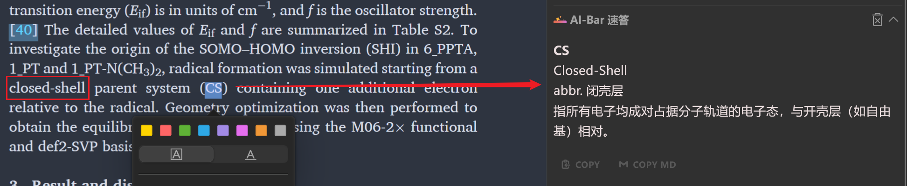
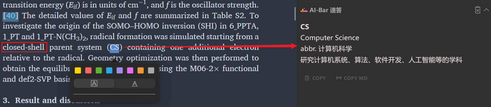
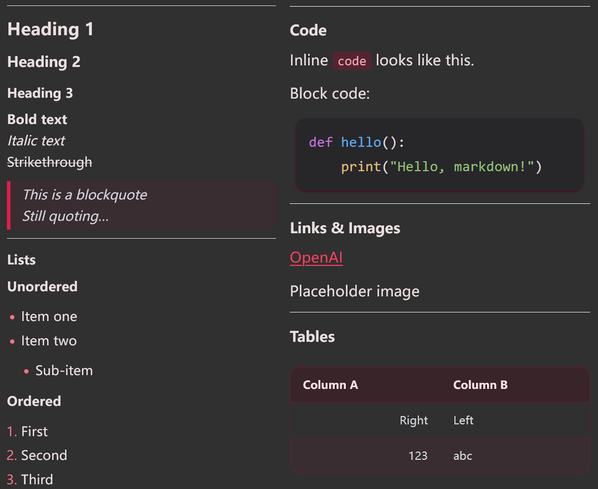
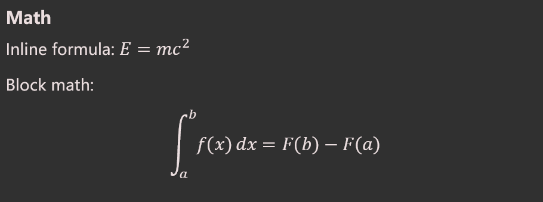

# Zotero AI Bar

  

[English](../README.md) | **简体中文**

一款美观便捷的 Zotero AI 插件，让 AI 助手住在你的手边。

您可以访问 [**项目主页**](https://zotero.fukeke.com/zh-cn/) 了解更多信息及详细教程。

## 赞助

如果你觉得这个项目对你有帮助，欢迎通过以下方式赞助，支持我继续开发和维护这个项目：

## 功能介绍

**把复杂的工作交给我们，简单的操作留给你自己**

### 划词工具栏

一划，一点，让 AI 助手帮你搞定：

### 上下文提取

自动提取文献中的关键信息，回答更准确

开启提取：

关闭提取：

### 完善美观的富文本

标题、**加粗**、_斜体_、~~删除线~~、`代码块`、[链接](https://github.com/swcxito/zotero-ai-bar/)、引用块、列表......

基础的`Markdown`，它都好看：

当然，公式也少不了：

### 现代的界面设计

丝滑流畅的动效，更多动效开发中！

深色模式、浅色模式随心切换：

## 使用教程

以下为快速教程，详细教程请访问[官网](https://zotero.fukeke.com/zh-cn/)：

1. 安装插件
2. 打开模型设置
3. 添加供应商，填写 API Key 和 model
4. 关闭模型设置页，设置会自动保存
5. 开始使用吧！

## 开发计划

- [x] ~~基础功能~~
- [x] ~~完善美观的富文本~~
- [x] ~~现代的界面设计~~
- [x] ~~多语言支持（中英文）~~
- [x] ~~基础设置~~
- [x] ~~文档~~
- [ ] 美化工具栏
- [ ] 工具链模型选择
- [ ] 自定义提示语
- [ ] 添加笔记
- [ ] 重新回复
- [ ] 独立窗口选项
- [ ] 连续对话
- [ ] 附件支持
- [ ] 新建对话
- 更多功能正在路上……

## 贡献

欢迎任何形式的贡献！无论是代码、文档、测试，还是建议和反馈，都非常欢迎！详见 [CONTRIBUTING](../CONTRIBUTING.md) ([中文](CONTRIBUTING_zh-CN.md)) 文件。

## 致谢

本项目基于以下项目开发： 
 

本项目参考了以下项目的部分实现： 
 

## 许可证

本项目采用 AGPL3.0 许可证，详情请查看 [LICENSE](../LICENSE) 文件。
