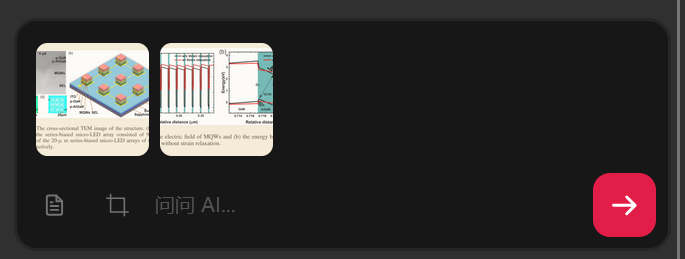
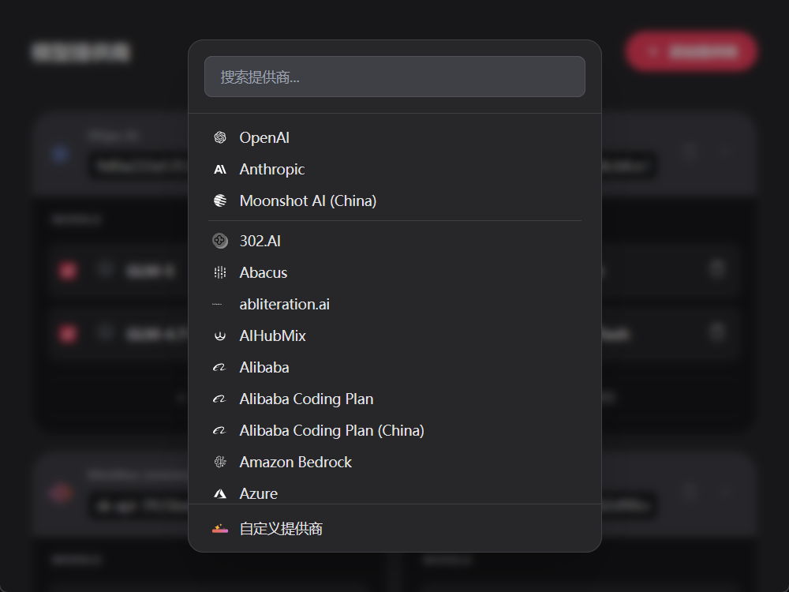
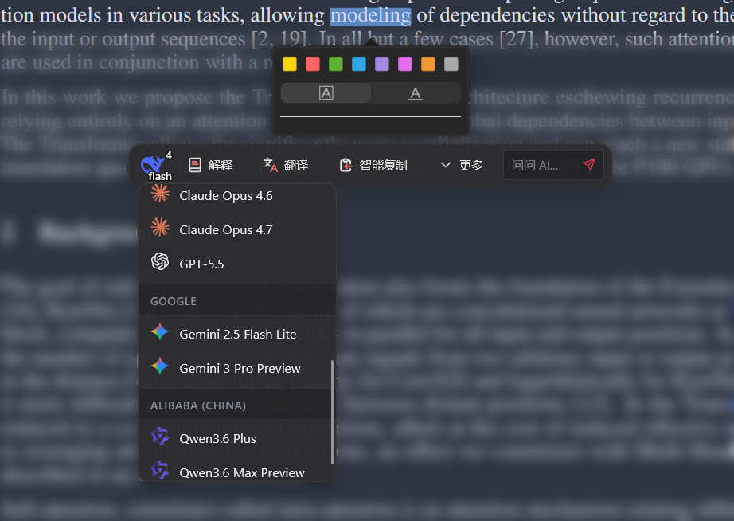
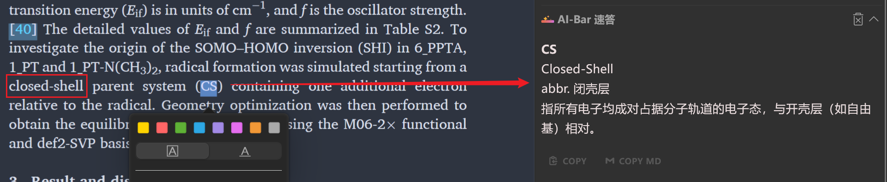
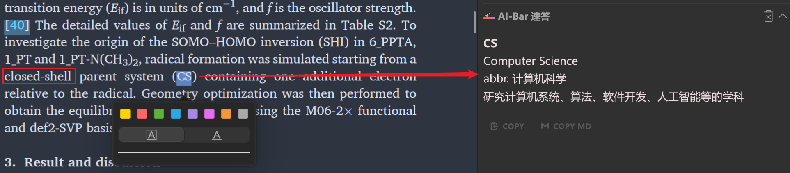
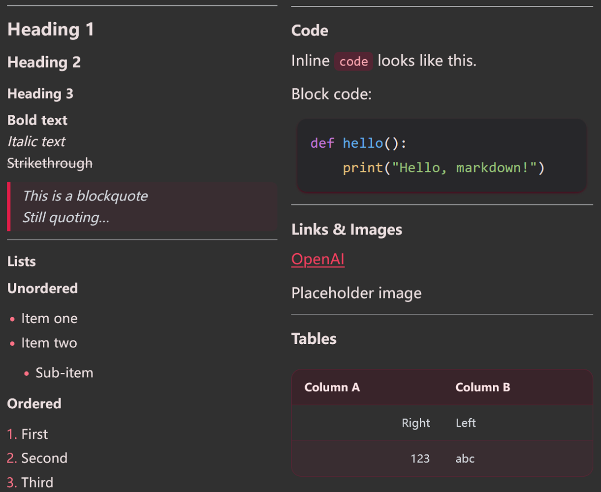
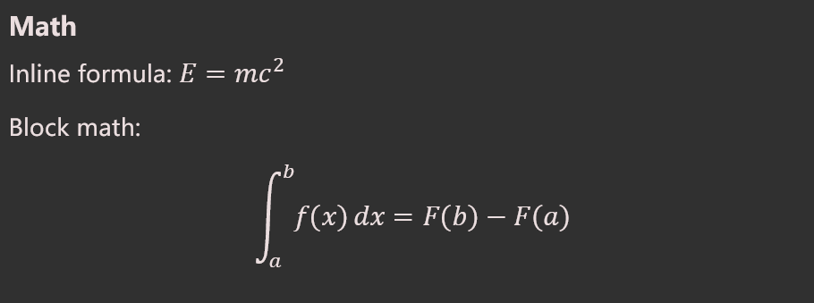

# Zotero AI Bar

[English](../README.md) | **简体中文**

好看又好用的AI工具栏！

您可以访问 [**项目主页**](https://zotero.fukeke.com/zh-cn/) 了解更多信息及详细教程。

## 赞助

如果你喜欢这个项目，欢迎在 GitHub 上点个 ⭐！

如果你觉得这个项目对你有帮助，欢迎通过以下方式赞助，支持我继续开发和维护这个项目：

## v1.3 更新内容

### Agent / 工具调用

- **自主 Agent 模式**：AI 可以调用工具搜索文档、读取页面/行、搜索文库、将 PDF 页面截取为图片、向你提出澄清问题等，无需手动提供上下文。
- **工具调用卡片**：每次工具调用以可折叠卡片形式展示输入和输出，与回复文本按流式顺序交错呈现。

### 思考强度控制

- 输入栏新增 **思考强度** 选择器，可按会话选择推理深度（`关 / 低 / 中 / 高 / 极高`）。
- 设置中提供 **默认思考强度** 选项（默认 `关`）。
- 翻译操作自动跳过推理以提升速度。

### Token 用量显示

- 每条 AI 回复在操作按钮旁显示 **当次 token 用量** 徽章（输入 ↑ / 输出 ↓）。
- 免责声明旁的 **上下文 token 指示器** 显示当前上下文用量及占模型上下文窗口的百分比（已知时）。

### 其他改进

- **更智能的自动滚动**：聊天区仅自动滚动到你的消息超出可见范围为止，生成期间可自由上滚阅读历史回复。
- **思考卡片自动滚动**：推理内容流式输出时保持最新内容可见。
- **选区感知提示词**：未选中文本时明确告知模型，不再出现"你选中了..."的幻觉。
- **带动画的思考强度下拉菜单**，新增"思考深度"标题。
- 多项 UI 打磨与 bug 修复。

## v1.2 更新内容

### 全新供应商 & 模型架构

- 开箱支持 **27 个供应商**和 **763+ 模型**。
- **原生 SDK 分发**：为主要供应商适配原生的 AI SDK，提高兼容性，解决过往的供应商兼容问题。
- **多环境变量支持**：需要多个环境变量的供应商（如 Azure）在配置对话框中显示独立输入框。
- **供应商及模型浏览器**：提供供应商和模型浏览界面，支持搜索，快速添加模型，避免繁琐的手动输入。
- **支持图片输入**：可以截图或粘贴图片，不怕图表看不懂！
  

### 其他改进

- **自定义提示词管理**：独立提示词编辑页面，支持拖拽排序。
- **智能复制**功能。
- **独立聊天窗口**，支持窗口托管模式。
- **公式块/代码块/表格优化**，防止超宽导致界面变形。

[//]: # '- 针对失败请求的重试按钮，无需重新输入提示词。'
[//]: # '  '

## 功能介绍

**把复杂的工作交给我们，简单的操作留给你自己**

### 快捷的模型配置

通过简单的配置界面，轻松添加和管理 AI 模型，支持多种供应商和模型选择：

工具栏上带有模型选择器，无需打开设置页面即可切换模型。

### 划词工具栏

一划，一点，让 AI 助手帮你搞定：

### 上下文提取

自动提取文献中的关键信息，回答更准确

开启提取：

关闭提取：

### 完善美观的富文本

标题、**加粗**、_斜体_、~~删除线~~、`代码块`、[链接](https://github.com/swcxito/zotero-ai-bar/)、引用块、列表......

基础的`Markdown`，它都好看：

当然，公式也少不了：

### 现代的界面设计

丝滑流畅的动效，更多动效开发中！

深色模式、浅色模式随心切换：

## 使用教程

以下为快速教程，详细教程请访问[官网](https://zotero.fukeke.com/zh-cn/)：

1. 安装插件
2. 打开模型设置
3. 添加供应商，填写 API Key 并选择模型
4. 关闭模型设置页，设置会自动保存
5. 开始使用吧！

## 开发计划

- [x] ~~基础功能~~
- [x] ~~完善美观的富文本~~
- [x] ~~现代的界面设计~~
- [x] ~~多语言支持（中英文）~~
- [x] ~~基础设置~~
- [x] ~~文档~~
- [x] 美化工具栏
- [x] ~~自定义提示词~~
- [x] ~~独立窗口选项~~
- [x] 连续对话
- [x] 新建对话
- [x] Agent / 工具调用
- [x] 思考强度控制
- [x] Token 用量显示
- [ ] 重新回复
- [ ] 附件支持
- 也许还有更多……

## 贡献

欢迎任何形式的贡献！无论是代码、文档、测试，还是建议和反馈，都非常欢迎！详见 [CONTRIBUTING](../CONTRIBUTING.md) ([中文](CONTRIBUTING_zh-CN.md)) 文件。

## 致谢

本项目基于以下项目开发： 
   

本项目参考了以下项目的部分实现： 
 

## 许可证

本项目采用 AGPL3.0 许可证，详情请查看 [LICENSE](../LICENSE) 文件。
